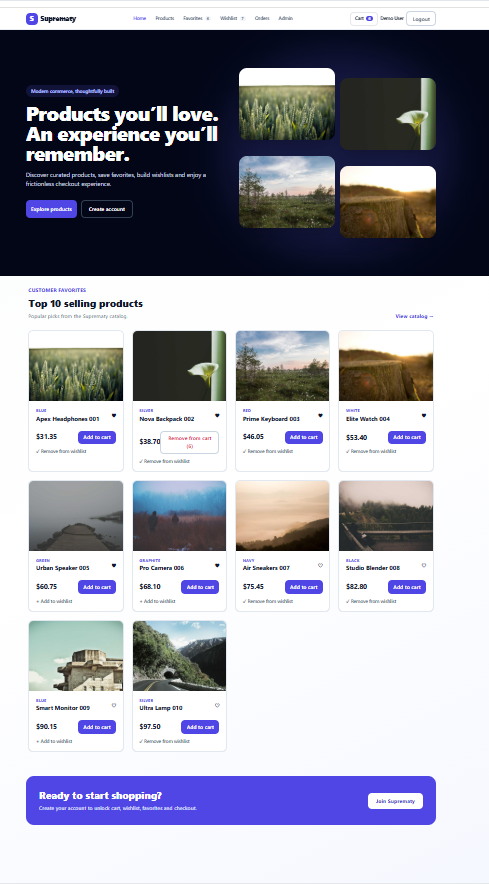
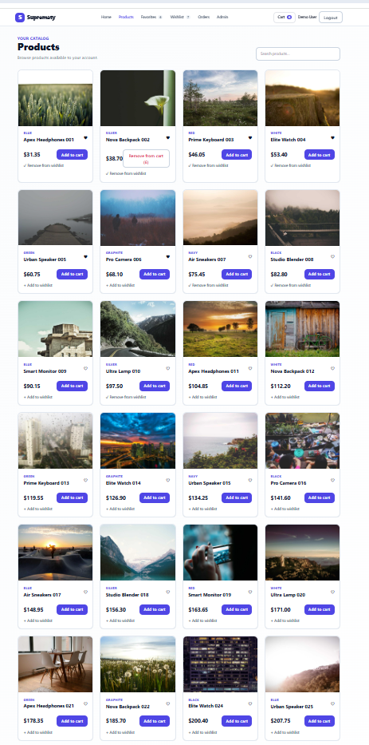
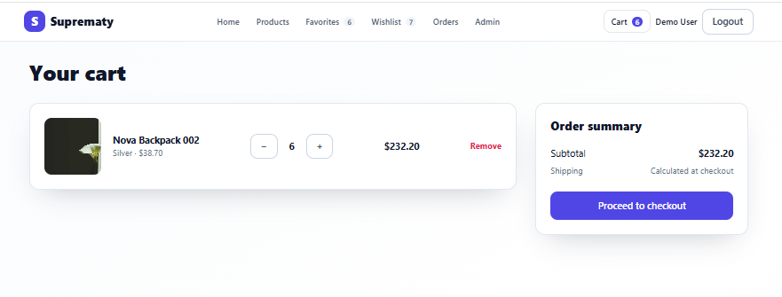
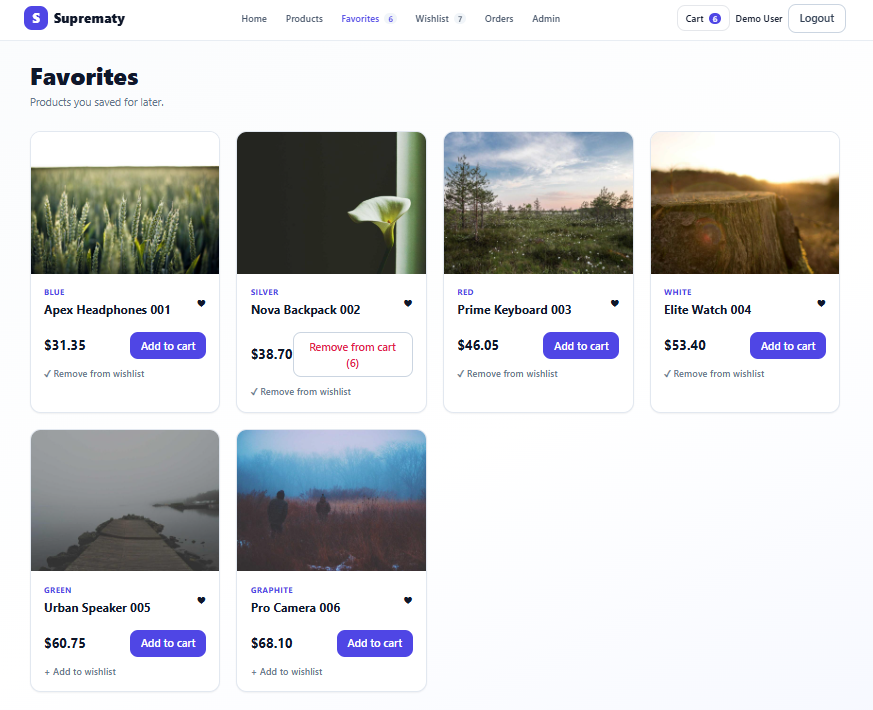
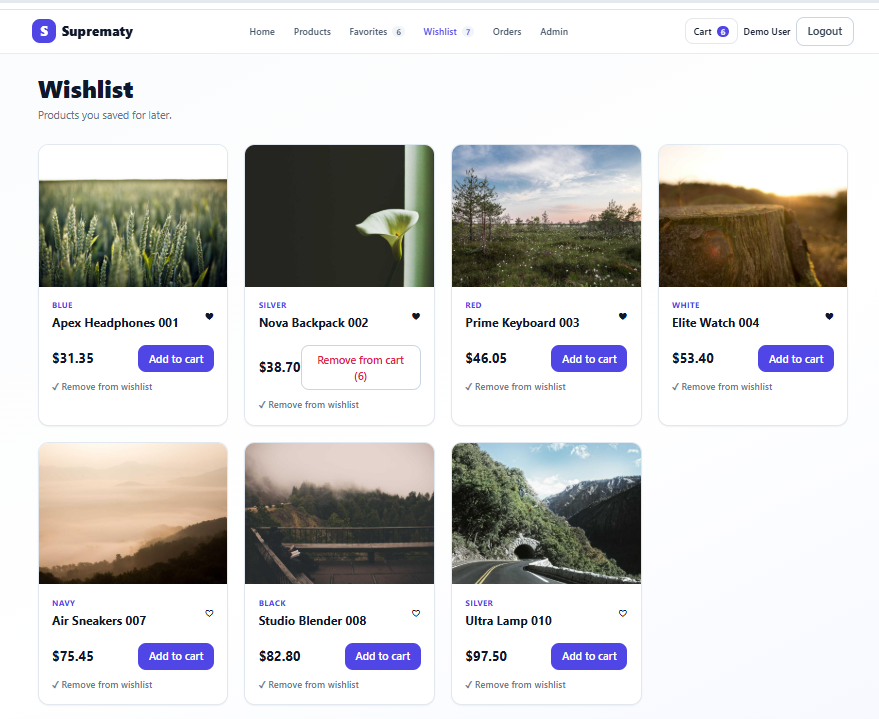
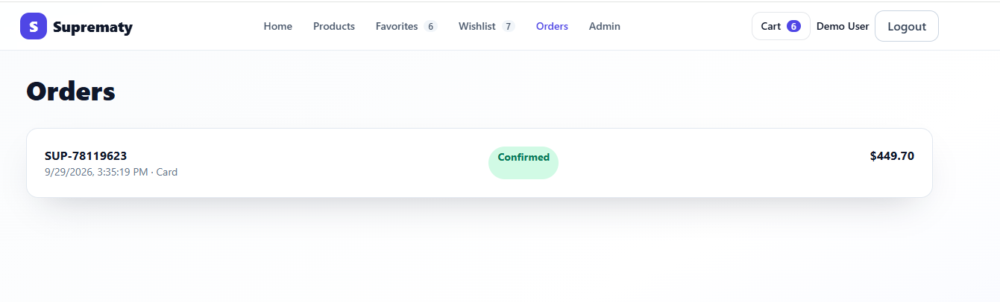
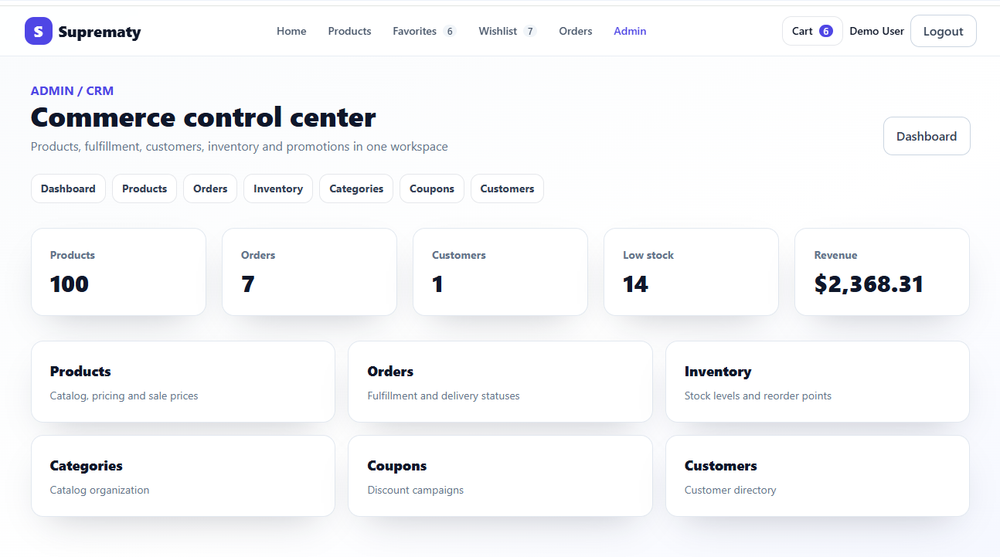
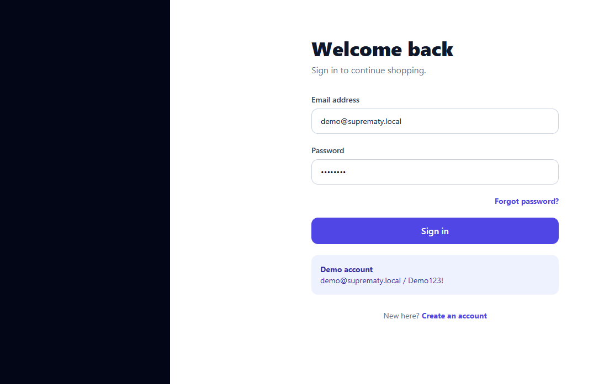
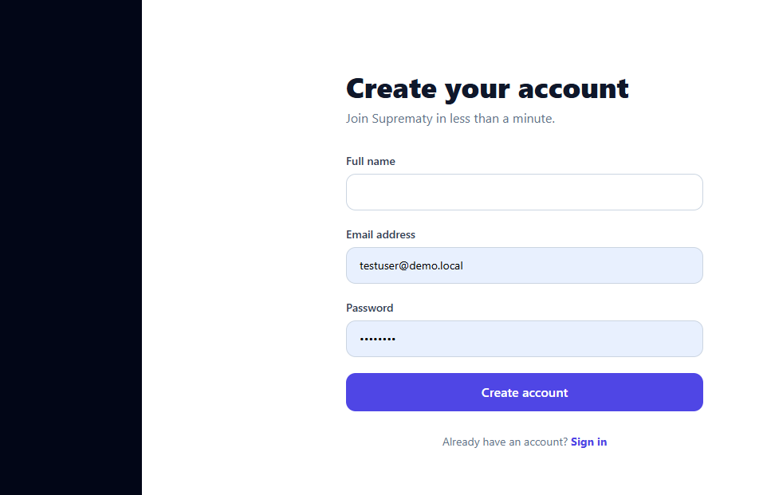
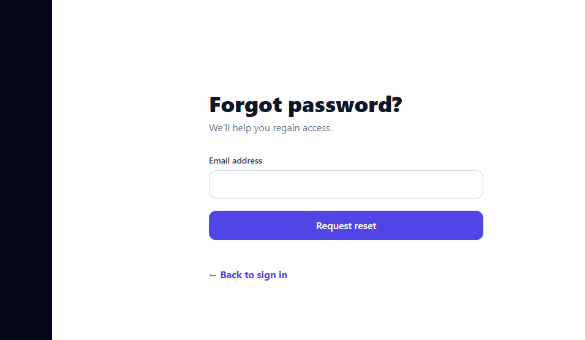

# SuprematyDemo

Production-oriented **.NET 10 + React** Products assessment using Clean Architecture, EF Core and SQLite.

## Architecture
- `SuprematyDemo.Domain` — enterprise entities/invariants; no infrastructure dependency.
- `SuprematyDemo.Application` — use cases, DTOs and repository abstractions.
- `SuprematyDemo.Infrastructure` — EF Core SQLite DbContext and repository implementation.
- `SuprematyDemo.Api` — HTTP/auth/composition root.
- `SuprematyDemo.UnitTests` and `SuprematyDemo.IntegrationTests`.
- `frontend` — React + TypeScript feature-oriented SPA.

The dependency direction follows Clean Architecture: business rules do not depend on EF Core or ASP.NET Core.

## API requirements
- Anonymous `GET /health`.
- JWT-secured `POST /api/products`.
- JWT-secured `GET /api/products`.
- JWT-secured `GET /api/products?colour=Red` with case-insensitive colour filtering.
- EF Core 10 + SQLite, async queries, no-tracking reads, indexed colour field.
- ProblemDetails/exception handling, CORS allow-list, Swagger in Development.

## React engineering
The client uses React + TypeScript, TanStack Query (cache/invalidation/server state), React Hook Form, Zod schema validation, Axios with auth/401 interceptors, feature-based modules, strict TypeScript, responsive components and React Query Devtools.

## Run
Requires .NET 10 SDK and Node 20+.
```bash
dotnet restore backend/SuprematyDemo.slnx
dotnet run --project backend/src/SuprematyDemo.Api

cd frontend
npm install
npm run dev
```
Set `VITE_API_URL` when the API is not hosted at `http://localhost:5000`. Paste a valid development JWT into the UI. The checked-in symmetric signing key is development-only; production should use an external OIDC provider/managed secret.

## Test/build
```bash
dotnet test backend/SuprematyDemo.slnx
cd frontend && npm run build
```

## Distributed architecture
See `docs/architecture.md` for the Mermaid diagram showing Products, Orders, Payments, Notification Service, API Gateway, identity provider and event bus. A production event implementation should use transactional outbox + idempotent consumers.

## UI screenshots

The following screenshots are stored under [`docs/images`](docs/images) and document the main storefront, authentication, customer, and administration flows.

### Home



### Product catalog



### Shopping cart



### Favorites



### Wishlist



### Orders



### Administration / CRM



### Login



### Sign up



### Forgot password



## Production hardening next steps
Use EF migrations rather than `EnsureCreated`, external OIDC (Entra/Auth0/Keycloak), OpenTelemetry, rate limiting, secret management, broker-backed integration events/outbox, CI quality/security gates, container orchestration and production-grade PostgreSQL/SQL Server while retaining SQLite for the coding exercise.


## Repository layout

- `backend/` — .NET 10 Clean Architecture solution, API and tests.
- `frontend/` — independent React + TypeScript/Vite application.
- `docs/` — distributed/event-driven architecture documentation.

## Swagger / OpenAPI

The API includes Swagger via Swashbuckle. In the Development environment, Swagger UI is available at `/swagger`. `Properties/launchSettings.json` sets `launchBrowser` to `true` and `launchUrl` to `swagger`, so Visual Studio / `dotnet run --launch-profile https` automatically opens the API documentation on launch.

## Authentication module
SuprematyDemo now includes signup, login, current-user, forgot-password and reset-password endpoints. Passwords are stored only as ASP.NET Core `PasswordHasher<T>` hashes. JWTs expire after 60 minutes by default. Reset tokens are cryptographically random, stored only as SHA-256 hashes, expire after 15 minutes and are single-use.

### Development demo user
- Email: `demo@suprematy.local`
- Password: `Demo123!`

The user is created automatically when the API initializes if it does not already exist.

### Auth endpoints
- `POST /api/auth/signup`
- `POST /api/auth/login`
- `POST /api/auth/forgot-password`
- `POST /api/auth/reset-password`
- `GET /api/auth/me` (secured)

In Development only, forgot-password returns `developmentResetToken` so the reset flow can be exercised without an email provider. Production should send the raw token by an email provider and never return it from the API.

Swagger includes the Bearer security scheme. Use the token returned by login with Swagger's **Authorize** button.

## Seeded commerce demo data
A clean database now seeds 100 catalog products with images, categories, regular/sale pricing, stock/reorder levels and sales counts; three coupons; and seven demo orders across Delivered, Shipped, Processing, Confirmed, Pending and Cancelled states. The clean-browser demo UI also starts with favorites and wishlist selections. Delete the existing SQLite `.db` file before first run of this version if upgrading from an older package, because this demo uses `EnsureCreated` rather than migrations.

## Source formatting

Frontend source is intentionally shipped as readable development source, not minified production output.
Commerce state, admin models, page components, and API code are kept in source form so the assessment can be reviewed and extended.
