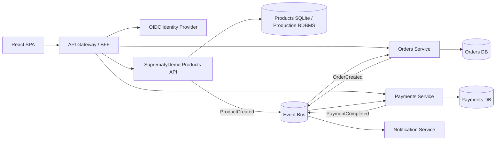

# Architecture

Clean Architecture dependency rule inside Products: `API -> Application <- Infrastructure`, with both Application and Infrastructure depending on Domain abstractions/entities as appropriate. For production event delivery, use a transactional outbox and idempotent consumers.
